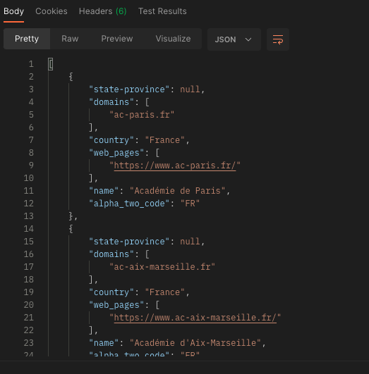

Data validation in API testing is the process of checking if the data returned by an API is correct, complete, and in the right format. 
It involves verifying things like data type, range, and consistency, and helps prevent errors that might affect the application using the API. 
Essentially, data validation ensures that the data received and sent by the API is accurate and reliable, making for a better user experience.

In Postman we can see it in the body response:

In our example, we can see according to the answer, the data that comes back from the server, and thus compare it to the desired result. For example, we expect that when we receive a country "France", that the ״alpha_two_code”  will be "FR".
# *Functional Testing*
Functional testing in API testing is the process of checking if an API does what it's supposed to do. 
It involves testing the API's ability to handle different types of input, like missing or invalid parameters, and returning the expected output. 
Testers use automation tools to simulate API requests and validate responses, making it easier to identify and fix issues.