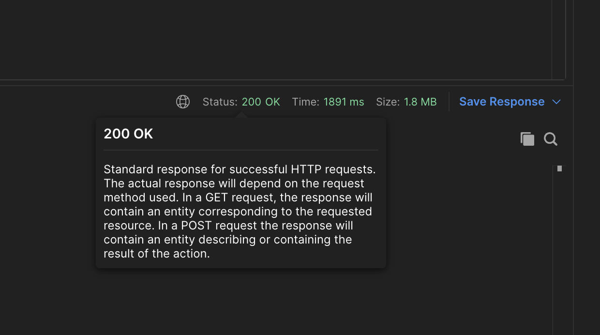

To test an API, identify the endpoints and parameters, send requests with sample data, verify the responses, and test for edge cases. 

Here are some examples of things we can and should verify when testing api endpoints:
# *Status Validation*
Status validation in API testing means checking if the API's response is what you expected. It's like checking if the traffic light is green before crossing the road. 
You want to make sure that the API is working correctly and can handle different situations like when something is missing or when the server is down. 
Checking the API's status code helps you identify any issues and debug them quickly. 
So, status validation is crucial to make sure your application can interact with the API safely and reliably, just like crossing the road safely.

After we create an API request from Postman.
The status code will be displayed in the upper right corner of the response panel.

You can click on the status code to see more information about it, including a description of what it means and the associated HTTP status class (e.g. 2xx, 3xx, 4xx, 5xx).


When we check statuses we can perform several different tests, as we discussed before.
We can also check negative tests by receiving a status from the 400 group, or different types of successes, such as creation, which is usually status 201, or deleted which is usually status 204 etc...
# *Schema Validation*
Schema validation in API testing confirms if the API response matches your expectations, much like checking a recipe's ingredients. 
An API schema is a blueprint that defines the response's structure and format. 
Validation checks if the response aligns with the schema, quickly flagging issues for debugging. 
In essence, schema validation ensures that you have all the necessary ingredients before cooking, guaranteeing the API's proper use by your application.

Let's say you have an API endpoint that creates a new user. 
You want to ensure that the data being sent includes a valid email address and a non-empty password.

Here's an example of a simple JSON schema for this use case:
```JSON
{
  "type": "object",
  "required": ["email", "password"],
  "properties": {
    "email": {
      "type": "string",
      "format": "email"
    },
    "password": {
      "type": "string",
      "minLength": 1
    }
  }
}
```
By validating incoming requests against this schema, you can ensure that the data being sent to your API meets the required format and contains the necessary information to create a new user.