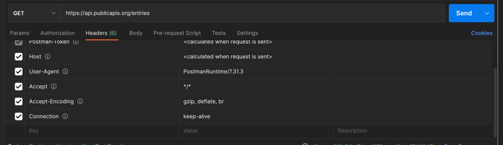
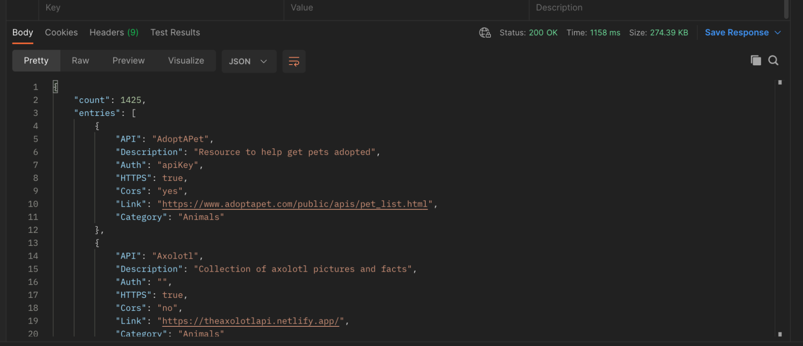
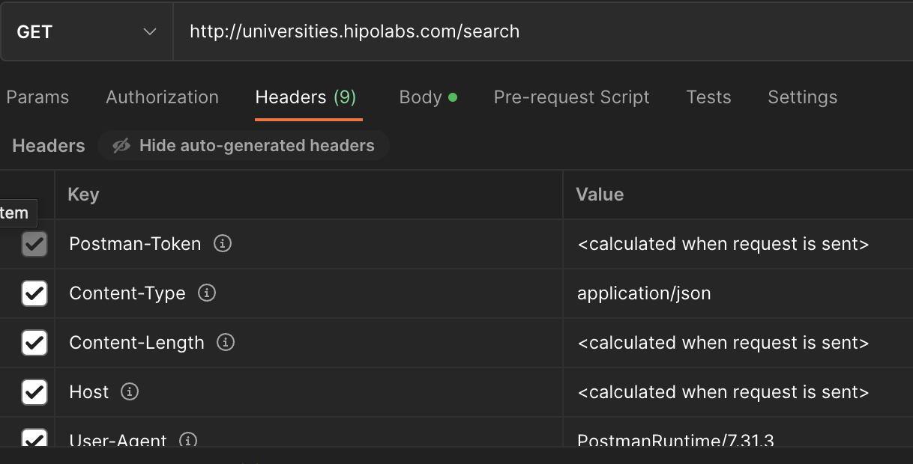
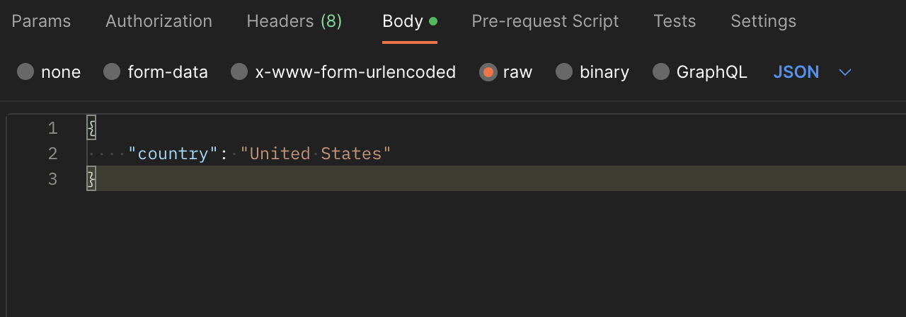

# *What is Postman?*
Postman is a popular software tool used by developers to test, develop, and document APIs. 
It provides a graphical interface for making HTTP requests and working with RESTful APIs.

With Postman, developers can easily create requests with various HTTP methods like GET, POST, PUT, and DELETE, and set headers, parameters, and authentication tokens. 
They can also organize and save their requests in collections, write tests to automate API testing, and generate documentation for their APIs.

Postman comes in two forms: a desktop app for Windows, Mac, and Linux, and a web-based version called Postman Cloud.
# Executing Requests with Postman
1. First, download and install Postman on your computer: https://www.postman.com/downloads/, and move to new title.
1. Open Postman and select the type of request you want to send (GET, POST, PUT, DELETE, etc.).
1. Enter the URL of the web server you want to send the request to: https://api.publicapis.org/entries
1. If necessary, add any headers or parameters to the request. 
You can do this by clicking on the "Headers" or "Params" tabs and entering the appropriate information.
1. Click the "Send" button to send the request.

1. Postman will show you the response from the web server, including any headers or body content.

1. If you want to save the request for later use, click the "Save" button and give it a name.

# *Headers*
If we need to add some data to a header request, like “Authorization”, we do so before clicking on the “Send” button by following the next few steps:
1. Click in the “Header” tab below the address bar.
1. Add the “Key” and “Value” you need 

# *Body*
1. Click on the "Body" tab below the address bar.
1. Choose the type of data you want to send in the body (e.g. JSON, form-data, x-www-form-urlencoded, raw, binary).
1. Enter the data you want to send in the body of the request.
