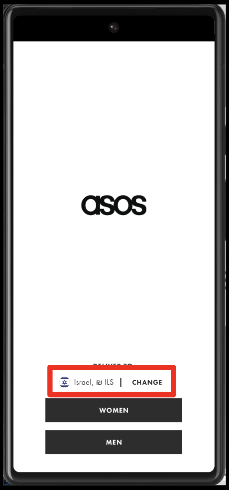

# Static content vs. dynamic content 
- Static content refers to elements on an app that do not change frequently, like headings, paragraphs, and images.
These elements can be easily identified using standard locator strategies such as ID, name, class name, or CSS selector when writing a script.
For example app logo: 

- Dynamic content refers to elements on an app that can change frequently based on user interactions or external factors.
Examples of dynamic content include pop-ups, dropdown menus, and other elements that can change based on user actions or server-side updates.
For example of The country and currency shown on the opening page of the sample application:

- Handling dynamic content can be challenging as the location and properties of these elements can change dynamically.

- Additional techniques such as waiting for content to load, using specialized locator strategies like XPath, or using tools like WebDriverWait can be used to handle dynamic content effectively.

- It is important to consider both static and dynamic content when automating tests , and to use appropriate techniques and strategies to handle each type of content effectively.

# Interacting with dynamic content
1. Use Explicit Waits: With explicit waits, you can wait for a certain condition to happen before moving on to the next step in your test. 
This comes in handy when you're waiting for content that changes all the time. 
To use it, you can rely on the WebDriverWait class to either wait for a specific amount of time or until a particular condition is fulfilled.

    Here's an example: the code below waits for a maximum of 10 seconds to find an element with an ID:
```Java
WebDriverWait wait = new WebDriverWait(driver, 10);
        wait.until(ExpectedConditions.visibilityOfElementLocated
                (By.id("com.asos.app:id/splash_floor_women")));
```
2. Try Dynamic Locators: If you think an element's attributes might change dynamically, you can use more flexible locator strategies, such as XPath or regex. These can help you find the element even if it changes.

    Here's an example: element with an ID that has the word "women" anywhere in the string:
```Java
  String strGender = "women";
        MobileElement womenButton = driver
                 .findElementById(
                  String.format("com.asos.app:id/splash_floor_%s",strGender));
```