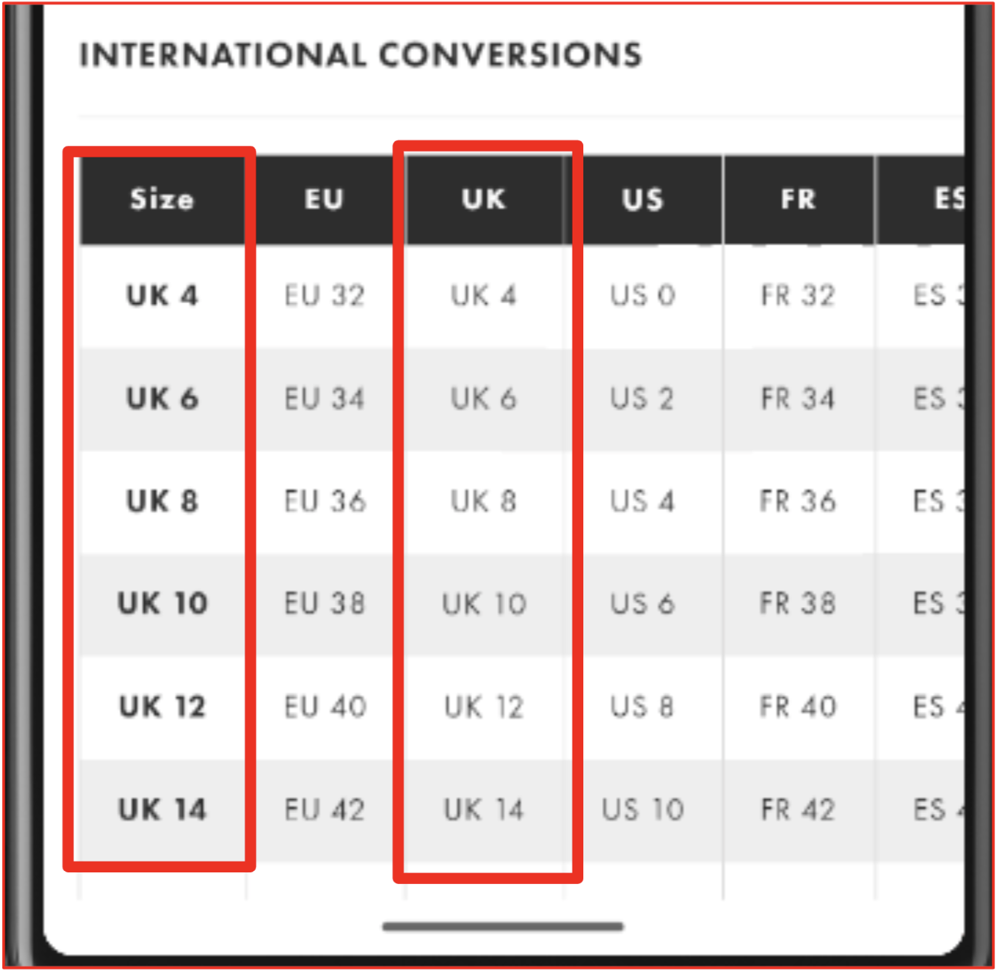

Write a test that checks that all the measurements in the first column in the size chart (uk) are equal to the third column as in the example


<details><summary>  
Click here to reveal the answer.  
</summary>

```Java
 for (MobileElement row: rows) {
            List<MobileElement> columns =
                    row.findElements(MobileBy.className("android.view.View"));
            Assert.assertEquals(columns.get(0).getText() ,
                                                columns.get(2).getText());
        }
```
</details>