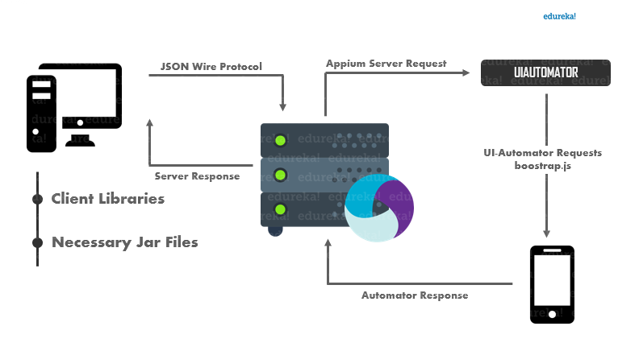

Here is a simplified overview of Appium's architecture:

- Appium Server: The Appium server is a web server that listens for requests from the Appium client. It is responsible for handling all communication between the client and the device.
- Appium Client: The Appium client is a program that communicates with the Appium server. It is responsible for sending commands to the device and receiving results from the server.
- Device: The device is the actual mobile device that is being automated. 
It can be an iOS device, an Android device.

When you run an Appium test, the following happens:

1. The Appium client sends a command to the Appium server.
1. The Appium server sends the command to the device.
1. The device executes the command and sends the results back to the Appium server.
1. The Appium server sends the results back to the Appium client.
1. The Appium client displays the results to the user.

Appium uses a variety of drivers to communicate with devices. 
For iOS devices, Appium uses the XCUITest driver. 
For Android devices, Appium uses the UiAutomator2 driver. 

Credit to the diagram: [https://www.edureka.co/blog/appium-architecture/]

Here are the different drivers that Appium supports:
- Android (Espresso): Espresso is a UI testing framework developed by Google for Android. It allows you to write expressive and efficient tests that interact with the user interface of your app.

- Android (UiAutomator2): UiAutomator2 is a native automation framework for Android. It allows you to interact with the UI of your app using a variety of methods, including text selection, scrolling, and clicking.

- IOS (XCUITest): XCUITest is a UI testing framework developed by Apple for iOS. It allows you to write tests that interact with the user interface of your app using a variety of methods, including text selection, scrolling, and clicking.

- Windows: Appium supports a variety of drivers for Windows devices. The most popular driver is the WebDriver driver.

- Mac: Appium supports a variety of drivers for Mac devices. The most popular driver is the WebDriver driver.

Appium also supports a number of other drivers, including:

- Sauce Labs: Sauce Labs is a cloud-based platform that provides a variety of drivers, including drivers for Android, iOS, Windows, and Mac.

- TestingBot: TestingBot is a cloud-based platform that provides a variety of drivers, including drivers for Android, iOS, Windows, and Mac.

- Sauce Labs Grid: Sauce Labs Grid is a private cloud-based solution that allows you to run your tests on a variety of devices and operating systems.
 
- TestingBot Grid: TestingBot Grid is a private cloud-based solution that allows you to run your tests on a variety of devices and operating systems.

The best driver for you will depend on the platform you are automating and your specific needs.
