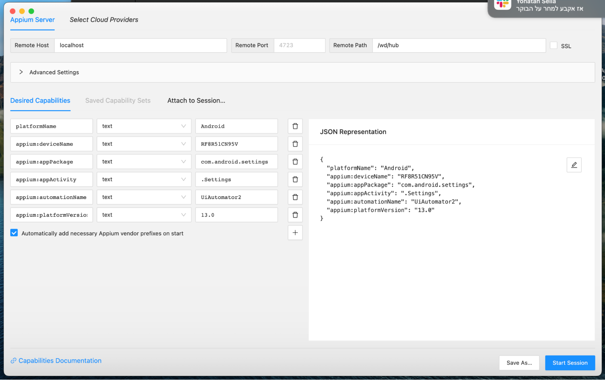
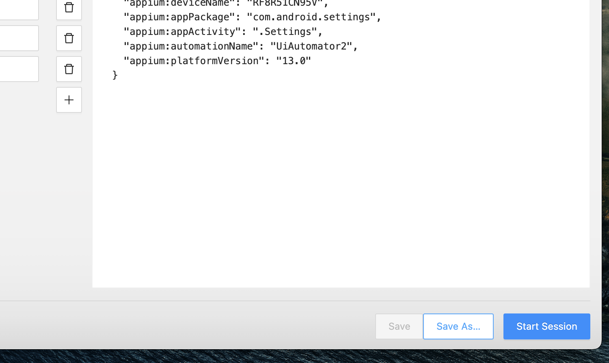

# Connecting a Device
Configuration
To locate elements in application on your phone or virtual device we use in Appuim inspector app, to do this we need to set some configuration, this is example for this config:
```
capabilities: [{
    // capabilities for local Appium web tests on an Android Emulator
    hostname: 'localhost',
    path: '/wd/hub',
    platformName: 'Android', // or "iOS"
    'appium:deviceName': 'emulator-5554', // or "iPhone Simulator"
    'appium:platformVersion': '13.0', // or "16.2" (for running iOS v16)
    'appium:automationName': 'UiAutomator2' // or "XCUITest"
    'appium:appPackage': "com.android.settings",
    'appium:appActivity': ".Settings",
}],
```

1. hostname: "localhost"
It specifies the hostname or IP address of the machine where the Appium server is running.

2. path: "/wd/hub"
It defines the path where the Appium server is listening for incoming WebDriver requests. The "/wd/hub" is the default path used by the Appium server.

3. platformName: "Android" // or "iOS"
It specifies the platform on which the application will be tested. 
Here, it is set to "Android", indicating that the application is intended for testing on Android devices. Alternatively, it can be set to "iOS" for testing on iOS devices.

4. appium:deviceName: "emulator-5554" // or "iPhone Simulator"
It specifies the name or identifier of the target device/emulator to be used for testing. In this example, "emulator-5554" is the device name for an Android emulator.
For iOS, it can be set to the name of the iPhone Simulator.

5. appium:platformVersion: "13.0" // or "16.2" (for running iOS v16)
It indicates the version of the operating system running on the target device or emulator. 
In this case, it is set to "13.0", representing Android version 13.0. For iOS, it would represent the specific version of iOS running on the device or simulator.

6. appium:automationName: "UiAutomator2" // or "XCUITest"
It specifies the automation framework to be used for testing. "UiAutomator2" is the default automation framework for Android, while "XCUITest" is the default for iOS. 
These frameworks provide the necessary APIs and capabilities for interacting with the application under test.

7. appium:appPackage: "com.android.settings"
It defines the package name of the application to be tested on Android. 
In this example, the package name is set to "com.android.settings", indicating that the Android Settings app will be tested.

8. appium:appActivity: ".Settings"
It specifies the main activity or entry point of the application to be tested. In this case, the app activity is set to ".Settings", representing the main activity of the Android Settings app.

# Run application and get elements
After we finish to install all the tools and  set the configuration we click on “start session”

Now we can open some app (calculator) and we click on refresh button, then we can locate our elements
