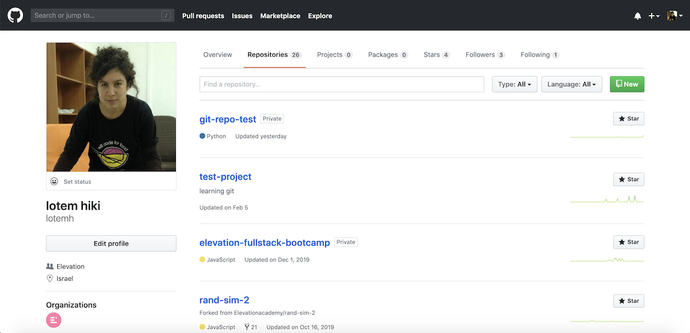
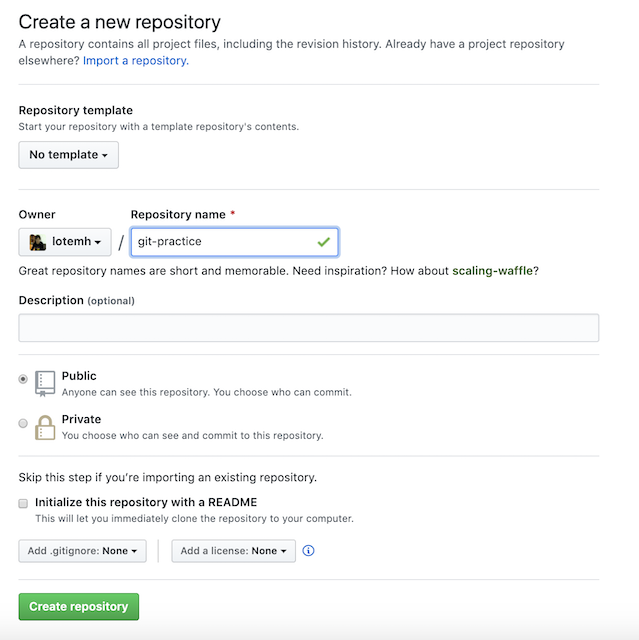

So far your "Git" project only lives locally (ie on your computer). Now, we'll add it to **github.com** so that others can see it (and contribute... more on that later). This also acts as a backup, just in case you somehow lose your local code.

  

Go to [github.com](https://github.com/) and log in to your account. Go to your profile and click the "Repositories" tab.

  


This is (or will be) a list of all your projects and the different versions of it. Click the big green button that says "New" to create a new repository.

On the next page, give your project a name. The name can be whatever you want but it's a good idea to have it match your local project name so let's use "git-practice".

Lastly, click "create repository".




  

  

  

The next screen has a bunch of instructions, don't worry about those - just keep reading this lesson - we'll work through it all. Start with copying the URL at the top.


  

  

Now, head back to your command line, and making sure you are in your project folder and run the command below. Just swap "YOUR_URL" for the URL you just copied.

  
```bash
git remote add origin YOUR_URL
```
  

Ours looked like this:

  


  

This command just added a reference to a "remote repository" to our local repository.

  

We could have give the reference any name we wanted, but we called it called origin as this is a common convention. Now, our local Git repo is linked to our Github repo!
 

The repos are linked but we need to manually push the contents of our local repo to github. Let's do that now:
 

```bash
git push origin master
```
  


The command is telling Git to "push our project to the origin repo's master branch". We'll talk more about branches in the future. The important thing here is that "Pushing" takes all local changes **you have committed** and adds them to your remote repository.

  
Now if you go back to Github, refresh your repo's page, and you will see your files!
 


Notice how the commit message from earlier along with time since the commit has been displayed on Github.
