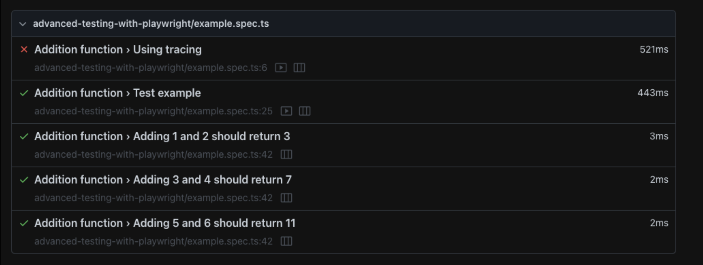

Built-in reporters in Playwright are used to display test results and progress in a readable and understandable format. 
The different reporters differ in their verbosity for successful runs and how they display failures. 

# Different types of reports
1. List reporter: 
This is the default reporter in Playwright, which prints a line for each test being run. 
It is useful for small test suites and it displays failures at the end of the run. 
To use the List reporter, you can run your tests with the following command: `npx playwright test --reporter=list`
Example:


2. Line reporter: 
This is a more concise reporter that uses a single line to report the last finished test and prints failures when they occur. 
It is useful for large test suites as it shows progress without listing all the tests. 
To use the Line reporter, you can run your tests with the following command: `npx playwright test --reporter=line`
Example:


3. Dot reporter: 
This is the most concise reporter that only produces a single character per successful test run. 
It is the default on CI and useful where you don't want a lot of output. 
To use the Dot reporter, you can run your tests with the following command: `npx playwright test --reporter=dot`
Example:


4. HTML reporter: 
This produces a self-contained folder that contains a report for the test run that can be served as a web page. 
By default, the HTML report is opened automatically if some of the tests failed. 
To use the HTML reporter, you can run your tests with the following command: `npx playwright test --reporter=html`

Example: 

If the test failed we can see the trace, screenshots and more details:


You can always also determine the type of report through the config file in the appropriate parameters by adding the following field:
```Playwright
import { defineConfig } from '@playwright/test';

export default defineConfig({
  reporter: 'line',
});
```
You can configure the host and port that are used to serve the HTML report, control the behavior of when the report should be opened, and set the output folder for the report using the Playwright config.

# Allure-Report
Allure is an open-source framework that provides detailed and informative reports for test automation results. 
It is designed to provide a clear and concise overview of the results, as well as comprehensive details about the test execution process.

Allure reports offer several features including:

1. Trend reports: Allure reports can show trends of test execution over time.
 It allows you to view trends such as pass/fail rates, test execution time, and more.

2. Detailed logs: Allure reports can provide a detailed log of the test execution process, including screenshots and error messages.

3. Customizable reports: Allure reports can be customized to display specific information, such as tags or labels, to make it easier to filter and analyze test results.

4. Integration with test frameworks: Allure reports can be integrated with various test frameworks, including Playwright, Selenium, and more.

To use Allure reports with Playwright, you need to flowing the next steps:
Step 1: install the @playwright/test-allure-reporter package: 
```Playwright
npm i allure-playwright
```
Step 2: install the allure command line package to run the test with allure reports:
```Playwright
npm i -D allure-commandline
```
Step 3: Run the test with allure report flag:
```Playwright
npx playwright test --reporter=allure-playwright
```
Step 4: Generate the results of allure:
```Playwright
npx allure generate ./allure-results --clean
```
Step 5: Then we can run the open command to see the report in browser:
```Playwright
npx allure open ./allure-report
```


Note: we can combine the common of generate and open report as on script in the package.json of our project like this:
```Playwright
"scripts": {
   "allure": "npx allure generate ./allure-results --clean && npx allure open ./allure-report"
 }
```
And you can run it in the command line: `npm run allure`

