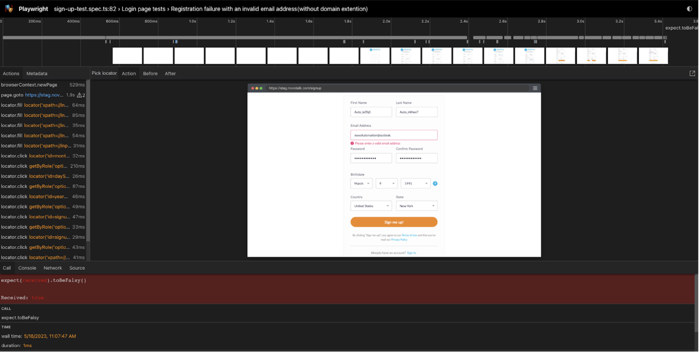

# What is tracing?
Tracing in Playwright is a feature that allows you to see the sequence of operations and events that occur during a script's execution. It can be helpful for debugging and understanding the flow of your automation code.

Here's an example of how to enable tracing in Playwright using TypeScript:
```Playwright
 test('Using tracing', async ({ page }) => {
        const browser = await chromium.launch({ headless: false });
        const context = await browser.newContext();

        // Enable tracing
        const tracePath = '/trace';
        await context.tracing.start({ path: tracePath, screenshots: true });

        page = await context.newPage();
        await page.goto('https://www.google.com');
        const title = await page.title();
        console.log(title);

        await page.close();

        // Stop tracing and close browser
        await context.tracing.stop();
        await browser.close();
    })
```

In this example, we're launching a Chromium browser instance, creating a new context, and then enabling tracing by calling context.tracing.start(). 
We specify the output path for the trace file using the path option and enable screenshots with the screenshots option.

Then, we navigate to `https://www.example.com`, get the page title, log it to the console, and close the page. 
Finally, we stop tracing with `context.tracing.stop()` and close the browser with `browser.close()`.

# Trace config
Another and more efficient way is to configure the trace through the config we talked about earlier, the trace in this way has several settings below:
Whether to record video for each test. Defaults to `'off'`.
- `'off'`: Do not record trace.
- `'on'`: Record video for each test.
- `'retain-on-failure'`: Record video for each test, but remove all videos from successful test runs.
- `'on-first-retry'`: Record video only when retrying a test for the first time.

It’s part of `"use"` section in the playwright.config.ts

# Trace viewer
The Trace Viewer can be used to gain insights into the performance of your Playwright scripts, diagnose issues with page navigation and element interaction, and optimize the overall behavior of your scripts.

To use the Trace Viewer, you first need to enable tracing in your Playwright project

After your script has finished running, you can open the Trace Viewer by visiting https://trace.playwright.dev/ and dragging and dropping your trace.zip file into the webpage. 
The Trace Viewer will then display a timeline of your script's interactions with the web browser, along with detailed information about each interaction, such as the URL of the page being loaded, the duration of the interaction, and any errors that occurred.
* Another very important thing is that you can inspect inside the trace just like in the browser and see in real time how a certain locator we need is built and understand if we have written it correctly


