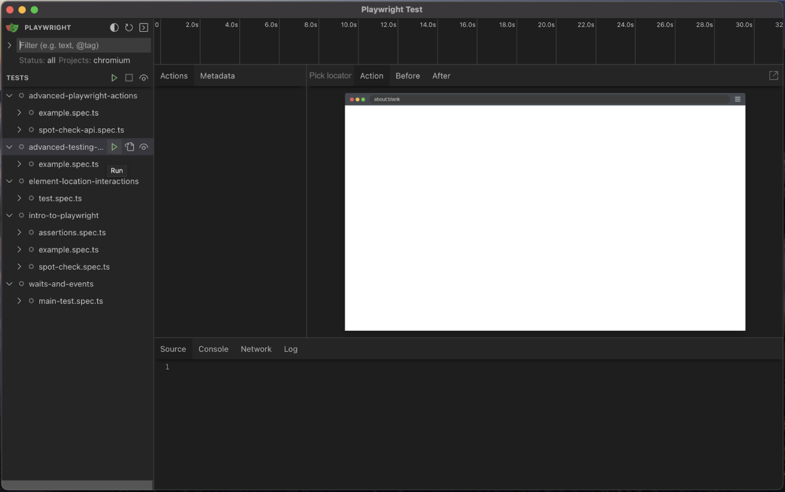

# What is UI Mode?
UI Mode lets us run tests and see each test separately. We'll also get a view that looks like Trace and the code of our test. This helps us figure out where the error is if something goes wrong, and if it's in the test code or the application being tested.

# Examples
To use UI Mode, we need to run the test from the command line like we did before, but this time we add the "--ui" tag to the command. Once we run this command, the UI window appears and we can start the test from there.
