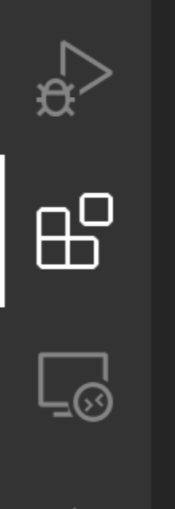
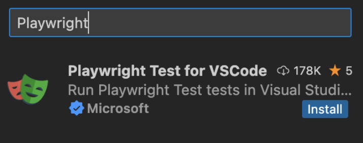
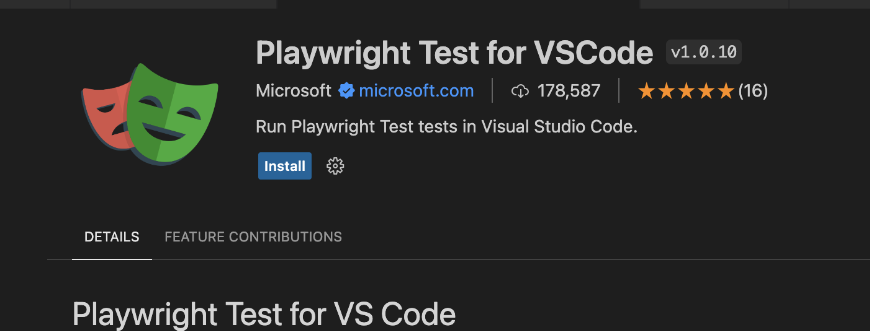
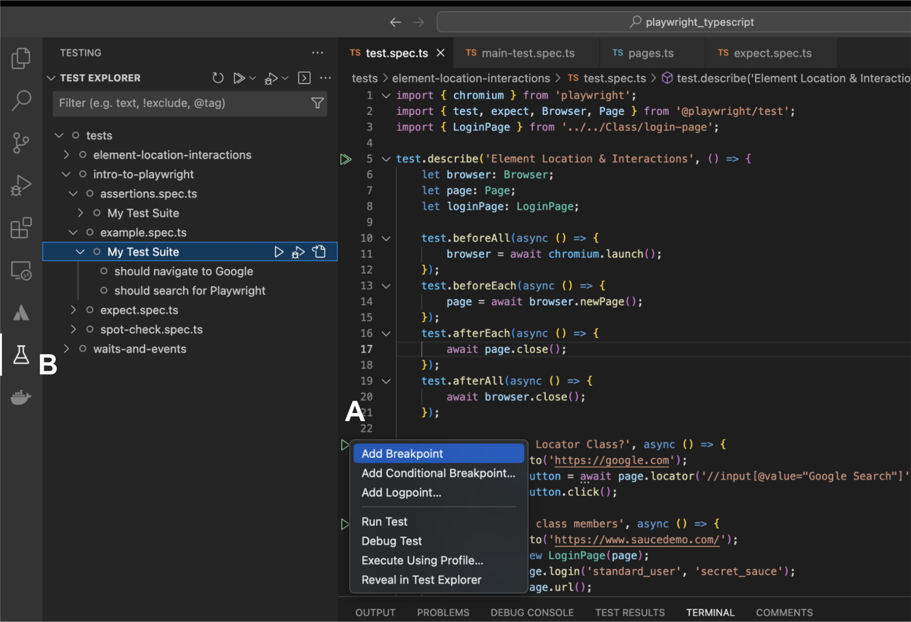

# Starting a new playwright project
At our Bootcamp, we set up the Playwright with TypeScript environment and use the VSCode IDE for development.

1. Create a new project directory for your project.
2. Open a terminal window and navigate to your project directory.
3. Initialize a new npm package by running the following command:
 ```npm init -y```
4. Install Playwright and TypeScript by running the following command:
 ```npm install playwright typescript```
5. Create a new TypeScript configuration file by running the following command:
 ```npx tsc --init```
6. Open the tsconfig.json file in your project directory and modify it as follows:
    - Set "target" to "es2017" or higher.
   - Set "module" to "commonjs".

7. Create a Playwright configuration:
```npm init playwright@latest```

    You can choose all the default parameters when prompted, just click enter.

    In the config file we have some changes to make which we will expand on later.

8. Create a new TypeScript file, for example index.ts, and start writing your Playwright code.

Here's an example index.ts file that launches a Chromium browser and navigates to the Playwright website:
```Playwright
import { chromium } from 'playwright'; 
(async () => { const browser = await chromium.launch();
   const context = await browser.newContext(); 
   const page = await context.newPage(); 
   await page.goto('https://playwright.dev/'); 
   console.log(await page.title()); 
   await browser.close(); 
})();
```
To run your TypeScript code, you'll need to compile it to JavaScript first. 

You can do this by running the following command: ```npx tsc. ```
This will compile your TypeScript code to a JavaScript file that you can run using Node.js by running the following command: ```node index.js.```

This will print out:

Fast and reliable end-to-end testing for modern web apps | Playwright

# Playwright plugin in vscode
A very effective plugin is Playwright plugin for running in vscode, it will help us a lot during the bootcamp and we will usually run through it
1. Open VS Code and click on the Extensions icon on the left-hand side of the screen (it looks like four squares arranged in a grid).


2. In the search bar at the top of the Extensions panel, type "Playwright" and press Enter.
(https://marketplace.visualstudio.com/items?itemName=ms-playwright.playwright)


3. The “Playwright Test for VSCode” plugin should appear in the search results. Click on the blue Install button to begin the installation process.


4. Once the plugin is installed, you may be prompted to reload VS Code in order to activate the plugin. If so, click the blue "Reload" button that appears.

5. After VS Code has finished reloading, you should see the Playwright plugin listed in your installed extensions.

6. Now we can run from several different places:
 a. Through our editor, we will see at the beginning of each test a small green triangle, right clicking on it will allow us to run in debug mode or normal running

   b. Another way is with the help of the plugin that appears on the left and looks like a test tube. Clicking on it will open all the tests in our project and allow us to choose which test to run and in which mode.

