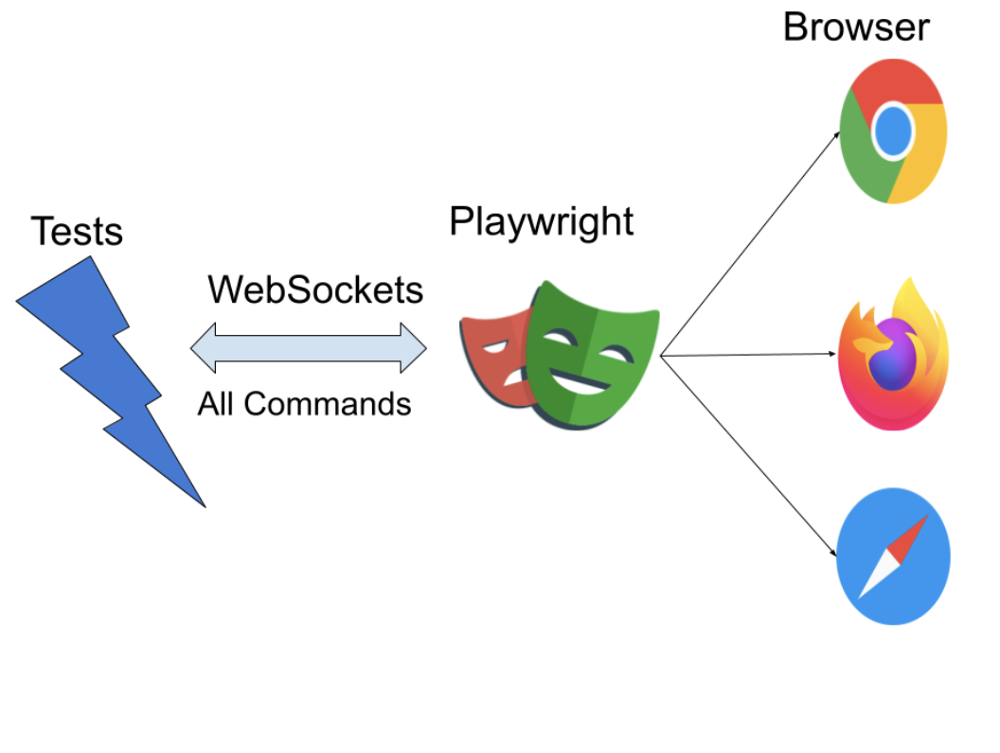

Before diving into Playwright architecture, let's take a look at a simple example of a flow in Playwright:
1. You create a Playwright script in VsCode  IDE and run it.
2. A browser window opens.
3. Playwright navigates to the architecture website's homepage and clicks on the "Contact" link.
4. Playwright fills out the contact form with a name, email, and message, and submits the form.
5. Playwright verifies that the success message is displayed on the page.
6. Playwright sends an HTTP response back to the script, where it's recorded.
7. The browser window is closed.

Throughout this process, Playwright uses various APIs and technologies to interact with the browser and carry out the necessary actions to test the "Contact" form on the website.

The Playwright architecture is how Playwright works behind the scenes to help automate web browsers. There are three main parts to it:

1. The Playwright API: This is the main way that developers can use Playwright to control web browsers. 
It lets them write scripts to do things like click buttons, fill out forms, and navigate through web pages.

2. The Playwright Core: This is the heart of Playwright. 
It includes the browser automation protocol, which lets Playwright talk to web browsers, and other important parts that make everything work smoothly.

3. The Browser Drivers: These are the parts of Playwright that talk to specific web browsers, like Chrome, Firefox, or WebKit.
They translate the commands that Playwright sends into actions that the browser can understand.

Overall, Playwright's architecture is designed to be flexible and easy to use. 
It can work with different web browsers and can be used in lots of different settings, like on a developer's own computer or on a cloud testing service.
