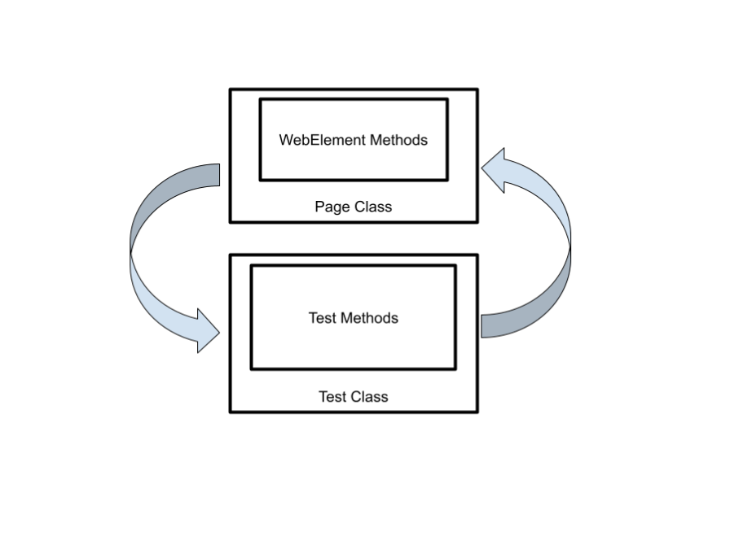

# Separation of concerns
- Separation of concerns is a software design principle that advocates dividing different parts of a program into distinct responsibilities that don't overlap.
- In test automation, it means separating the responsibilities of the page and the test.
- The page's responsibility is to encapsulate the webpage's functionality and provide methods to interact with it.
- The test's responsibility is to verify the application under test is functioning correctly by ensuring the right behavior and producing the correct results.
- Maintaining separation of concerns is critical to making the code more readable, maintainable, and extendable.
- Validations are specific to the test and used to verify the results of actions taken on the page, so they belong in the test and not the page.

Testing with POM means organizing your code in a way that makes it easier to automate tests for webpages or applications. 
You can think of it like having different teams working on different parts of a project, where one team focuses on creating the pages or components, and another team focuses on testing them.

POM helps to ensure that each page or component is self-contained, with its own set of methods and properties, making it easier to write automated tests that interact with the page in a predictable way.

In the example below, we can observe that the login functionality is encapsulated in a single method in the LoginPage class, while the test logic for the login process is implemented in the test class itself:

```Playwright
    test('Full login function', async ({page}) => {
        await page.goto("https://www.saucedemo.com/")
        const loginPage = new LoginPage(page)
        await loginPage.fullLoginFlow("standard_user", "secret_sauce")
        await expect(page).toHaveTitle("Swag Labs")
    })
```

Later we will discuss much more about writing tests and their principles