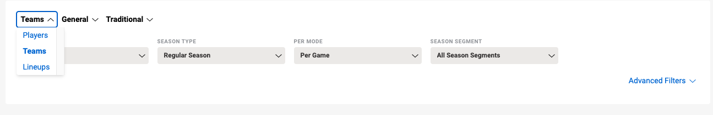

In this exercise we will implement tests using the advanced techniques we have learned.
We will be using this page: 
https://www.nba.com/stats/leaders

#### Exercise
1. Create hooks that will start a new browser before every test and close it after each test.
2. Write different tests for Team stats and player stats.
Write at least 5 different tests for each.

3. For relevant tests add scenario outlines to test the same scenario with different data sets.
For example: a test that validates that when I set the filters to season 2010-11 and sort by WIN% Chicago Bulls appear on the top of the list.
When I run the same test for season 1999-00 it’s the Los Angeles Lakers.
4. Use Page Object Model with the stats page as the main page and the “teams” and “players” data tables as components within that page.
5. Use both Scenario outline and step data tables.
6. Use different step classes and implement test context to share data.