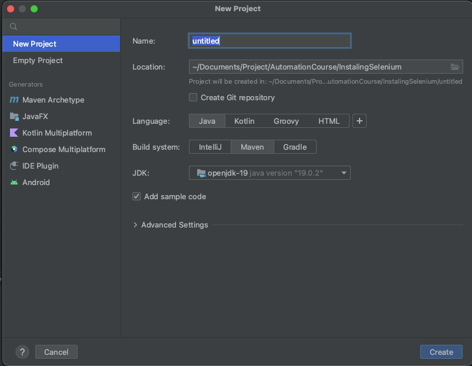

Here are the general steps for installing and configuring Selenium for Java:
1) **Download ChromeDriver** -  Choose a WebDriver that is suitable for your operating system from [this link](https://sites.google.com/chromium.org/driver/) 

    **Important Note:** Make sure that the version of your Chrome browser is compatible with the driver you downloaded. If you haven't downloaded either the compatible browser or driver, it may cause issues.

2) **Start a new Project**
    a) Open IntelliJ and select "New Project" from the welcome screen.
    b) Choose "Java" as the project type and select the Java SDK version you want to use.
    c) Give your project a name and location on your computer
    d) Select "Maven" as the project template and click "Create".

3) **Add Selenium**
    a) Once you've created the project, you can add Selenium dependencies to your project by adding the following code to your `pom.xml` file:
    ```html
    <dependencies>
      <dependency>
        <groupId>org.seleniumhq.selenium</groupId>
        <artifactId>selenium-java</artifactId>
        <version>3.141.59</version>
      </dependency>
    </dependencies>
    ```
    b) Click "reload maven":
    

4) **Update Driver Path** - Note that the driver you downloaded must be copied into the project folder and given the correct path.
```java
package IntroToSeleniume;

import org.openqa.selenium.chrome.ChromeDriver;

public class Main {
    public static void main(String[] args) {
        System.setProperty("webdriver.chrome.driver",
 "../Documents/Project/automation_course/chromedriver");
        ChromeDriver driver = new ChromeDriver();
        driver.get("https://practicetestautomation.com/practice-test-login/");
        driver.close();
    }

}
```

Now we are ready to write our first script!

But first, let’s learn a bit about browsers.