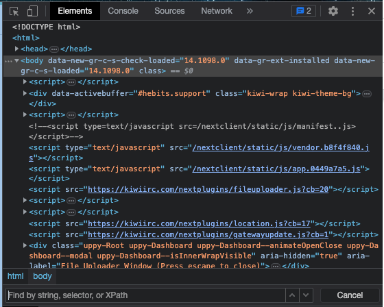

When we are working with web automation, it is crucial to have a way of identifying elements on a web page that we want to interact with. 
# *What Are Elements?*
An element is a component that defines the structure and content of a web page. 
It consists of a start tag, content, and an end tag, and can include attributes that provide additional information about the element. 
```java
<tagname>Content goes here...</tagname>
```
# *What Are Locators?*
Locators in Selenium are techniques used to identify web elements on a web page. 
They are essentially "addresses" that allow Selenium to locate and interact with web page components such as buttons, text fields, links, and more. 
Selenium supports multiple types of locators such as ID, name, class name, CSS selector, and XPath expression. 
Locators are essential in Selenium automation as they enable developers to automate user actions and tests.

# *Locating Elements By ID*
Using the id tag is considered the most efficient method for locating elements, as it provides a unique identifier for the element, resulting in the most accurate results. 
**It is highly recommended to prioritize using locators with an id whenever possible.**
```java
driver.findElement(By.id("my-element-id"));
```

# *Additional Types of Locators*
**By Name:**
Development teams sometimes use the name attribute to assign names to elements in their applications. 
Therefore, performing a name search can be effective provided that the tag is present.
```java
driver.findElement(By.name("my-element-name"));
```

**By Class Name:**
'className()' is a method in Selenium WebDriver used to locate an HTML element using its class name. Since multiple elements can have the same class attribute, we must specify the desired element when using this attribute.
```java
driver.findElement(By.className("my-element-class"));
```

**By Tag Name:**
The ‘tagName()’ method takes a single argument: a string representing the tag name of the element we are looking for. 
For example, we can locate all ‘div’ or ‘span’ .
**We should limit the usage of tagName as it is a general approach**, and use it only if we are certain that there is exactly one element with the tag we are looking for.
```java
driver.findElement(By.tagName("div"));
```

**By Link Text:**
The ‘linkText()’ method takes a single argument: a string representing the visible text of the anchor element we are looking for. 
For example, if we want to locate an anchor element with the text "Click here", we would call:
```java
driver.findElement(By.linkText("Click here"));
```
Using this search **can be problematic** if you change the text of the link, so we use it only if we have no other options.

**By Partial Link Text:**
The ‘partialLinkText()’ is a locator strategy that takes a single argument: the partial text you want to match against the link text of the element. 
It returns the first matching element found on the current web page. We will use this when we want to find the first link.
```java
driver.findElement(By.partialLinkText("My"));
```

**By CSS Selector**
To locate an element by CSS selector, you can use the By.cssSelector method, which takes a CSS selector string as its argument.
For example, to find an element with a specific class, you can use:
```java
WebElement element = driver.findElement(By.cssSelector(".my-class"));
```
This will locate the first element on the page that has the class my-class.
Similarly, you can use other CSS selectors to locate elements based on their attributes, tags, or other properties. 

For example:
```java
// Find an element by ID
WebElement element = driver.findElement(By.cssSelector("#my-id"));

// Find an element by attribute value
WebElement element = driver.findElement(By.cssSelector("input[type='text']"));

// Find an element by tag name
WebElement element = driver.findElement(By.cssSelector("button"));
// Find the first child of an element
WebElement element = driver.findElement(By.cssSelector("div:first-child"));
```
Note that CSS selectors can be less reliable than other methods like XPath, as they rely on the design of the element, which can change frequently and even in small ways that may go unnoticed. 
Therefore, it's important to **use CSS selectors with care** and to be mindful of their potential limitations.

**By XPath:**
XPath is a way to locate web elements within a webpage by specifying the path of the element from the root. Using XPath for searching is a highly effective and practical approach. 
It enables us to focus on several parameters, including tags, classes, and attributes, which ultimately leads to the creation of high-quality locators.

Below are examples of different ways to search for elements using XPath in Selenium.

To get all the elements that contain the div tag:
```java
driver.findElement(By.xpath("//div"));
```
This search will return all the divs on the page, which is not practical. 

To narrow down the search, we can add another parameter within [ ] to specify a class name:
```java
driver.findElement(By.xpath("//div[@class='className']"));
```

To focus the search more precisely, we can use a more specific XPath path with more tags and parameters:
```java
driver.findElement(By.xpath(
"//div[@class='className']//img[@id='profileImage']"));
```
This selector finds an element with an img tag and id ‘profileImage’ which has a div parent whose class is ‘className’.

If we can't locate an element by its attributes, we can use the text() method to find the element by the exact text it contains:
```java
driver.findElement(By.xpath("//div[text()='some text']"));
```
We can also use the contains() function to search for elements that contain specific text:
```java
driver.findElement(By.xpath("//div[contains(text(),'some text')]"));
```

To find an element that is inside another element but does not have its own identifier, we can locate it using its "parent" element and the “.” symbol:
```java
driver.findElement(By.xpath("//div[./h4[contains(text(),'some text')]]//img[contains(@src,'image.src')]"));
```

When we want to use a dynamic element, we can use the String.format() method to create a dynamic selector:
```java
driver.findElement(By.xpath(String.format("//div[contains(text(),'%s')]",value)));
```

In this example, %s is a placeholder that is replaced by the value of the value variable.


All locators are wrapped by a WebElement, which then allows actions to be performed on it.

# *What to Use and When*
- Ideally we will want to use never-changing ids when possible. This will help our tests be more stable.
- When we see generated IDs (ex: ‘container_eV58xp’), we should know that they are unreliable and should never be used.
- If we have some other unique attribute like ‘test-id’, ‘name’, ‘aria-label’ or anything else that we can be confident about, we should use that.
- Otherwise, we should use an XPath expression that will definitely find our element and no other elements.
- With XPath, we can use the help of parent/child/sibling elements to make our locator more specific and accurate.

To find an element using the Chrome DevTools and findElement by XPath in Selenium, follow these steps:

1. Open Google Chrome and navigate to the page that contains the element you want to locate.
1. Right-click on the element and select "Inspect" from the context menu. This will open the Chrome DevTools window.
1. Look for attributes/classes/name/id or anything else that can help you locate this element without accidentally locating other elements.
1. Click ctrl+f to open the search bar


1. Input your locator in the search bar to make sure it locates the element you want.
1. Copy your locator into selenium:
    ```java
    WebElement element = driver.findElement(By.xpath("paste the copied XPath expression here"));
    ```

1. You can now interact with the element using the methods available in the WebElement interface.

Note that the XPath expression copied from the DevTools window may contain dynamic parts, such as generated IDs or dynamic classes. You may need to modify the XPath expression to make it more stable and reliable for your automation scripts. 