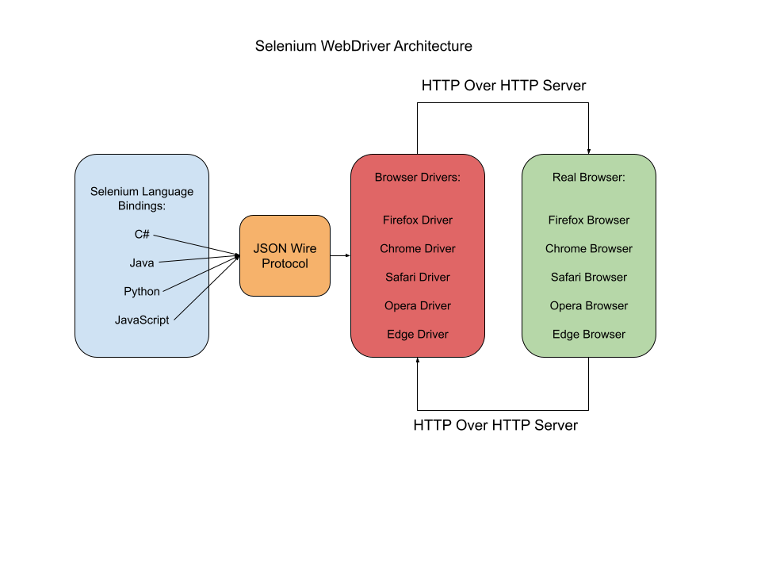

Before diving into Selenium architecture, let’s take a look at a simple example of a flow in Selenium:
1) You want to test to see if a "login" button on a website works properly.
2) You write a script in your favorite IDE, and click run.
3) A  browser window opens.
4) Selenium starts a process that includes API Requests and JSON and eventually sends HTTP requests to the browser, 
5) The browser interprets these requests, including adding a username and password to the login form and clicking login. This process happens in the Browser's UI.
6) Finally, the browser sends the HTTP response it receives after clicking login back to the script, where it's recorded.

Before delving into the architecture of Selenium WebDriver, it's essential to take a look at its components. Selenium’s architecture is comprised of four layers.

To visually represent the entire architecture and understand its structure, we can use the following diagram:


# 1) Selenium Client Library
The Selenium Client Library, also known as language bindings, is a programming library that contains commands in the form of an external jar file. These commands are compatible with the Selenium protocol or the W3C Selenium protocol.

The Selenium client library can be categorized into two groups:

## WebDriver Protocol Clients
These act as thin wrappers around WebDriver protocol HTTP calls. 

## WebDriver-Based Tools
These are higher-level libraries that enable us to work with WebDriver automation. Tools like Selenide, webdriver.io, or AI-powered Selenium extensions like Healenium come under this group. These tools rely on lower-level WebDriver protocols to function efficiently.

# 2) JSON Wire Protocol
- JSON is a common method for communication in web services, especially in REST.
- Selenium WebDriver uses JSON to enable communication between client libraries and drivers.
- Client JSON requests are transformed into HTTP requests, which the server interprets.
- Data sent back to the client is converted back into JSON format, known as serialization.
- This approach maintains browser privacy and allows the server to interact with client libraries regardless of the programming language used.

# 3) Browser Drivers
- Browser drivers link Selenium libraries to web browsers, enabling Selenium commands to be executed on the browser.
- Each browser has its own set of drivers, which can be downloaded from the official Selenium repository.
- To use a browser driver, you need to import the corresponding Selenium package into your code, such as `org.openqa.selenium.[$browsername$];`.

Additionally, we must set the System property of the driver's executable file using the following syntax:
`System.setProperty(key, value)`

Here, "key" refers to the driver's name, and "value" refers to the path to the driver's executable file on the user's device. The following code snippet demonstrates this process:

```java
import org.openqa.selenium.chrome.ChromeDriver;
public class Main {
    @Test
    public void browser() {
        System.setProperty("webdriver.chrome.driver",
                           "C:\downloads\chromedriver.exe");
        ChromeDriver driver = new ChromeDriver();
    }
}
```
When this code is executed, Selenium will open the Chrome browser.

# 4) Browser
- Works with all major web browsers like Chrome, Safari, Firefox, Opera, and Internet Explorer.
- Can run on different operating systems such as Windows, Mac OS, Linux, and Solaris.

## Working with Selenium WebDriver
Think of Selenium WebDriver as a conversation between a foreign tourist, you, and your friend. 
The tourist speaks a language that you understand, but your friend knows the way around the city. 
So you translate the tourist's requests and questions for your friend, who provides you with directions. 
You then translate the directions back to the tourist.
It's a simple process, and it's similar to how Selenium Architecture components work.

For example, here is Selenium JavaScript code for a login process:
```java
package introToSelenium;

import org.openqa.selenium.WebDriver;
import org.openqa.selenium.chrome.ChromeDriver;
import org.openqa.selenium.By;
import org.openqa.selenium.WebElement;

public class Main {
    public static void main(String[] args) {
        System.setProperty("webdriver.chrome.driver", "path/to/chromedriver");
        ChromeDriver driver = new ChromeDriver();
        driver.get("https://practicetestautomation.com/practice-test-login/");
        WebElement user = driver.findElement(By.id("username"));
        user.sendKeys("student");
        WebElement pass = driver.findElement(By.name("password"));
        pass.sendKeys("Password123");
        WebElement submit = driver.findElement(By.className("btn"));
        submit.click();
    }
}
```

This is what happens when you execute the code above:

1) The Chrome browser will open and navigate to the given URL.
2) The Selenium library communicates with the Selenium API to send commands to the browser driver through JSON wired protocol.
3) The JSON request is converted into HTTPS requests and sent to the HTTP server.
4) The server parses the commands and the driver executes them on the browser's UI.
5) Once the execution is complete, the HTTP server sends the response back to the test script, which records the results in JSON format.

In this scenario, the Selenium client library is your friend who knows the directions, the test script is the tourist, and the WebDriver is you. 
You use your multilingual skills (Selenium API) to communicate with the tourist and successfully execute the script, helping the tourist reach their destination.

