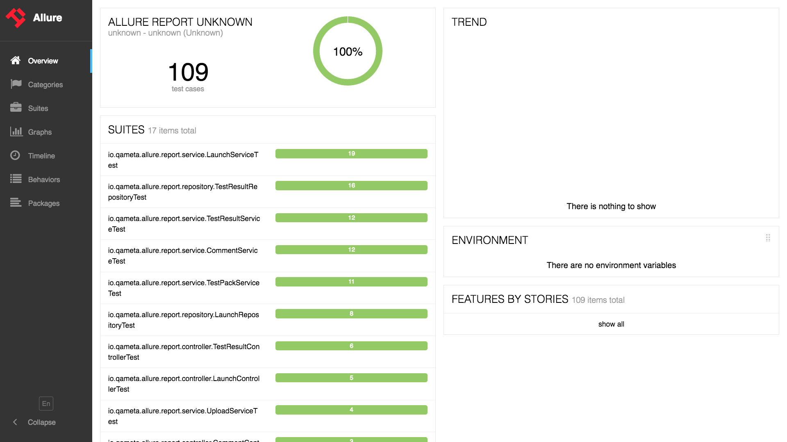

# Intro
Reporting plays a crucial role in automation testing as it provides valuable insights into the test results and overall test execution process. 
It allows testers, developers, and stakeholders to understand the status of tests, identify issues, and make informed decisions. 
Effective reporting helps track progress, monitor test coverage, and ensure the quality of the software being tested.
# What should be in the report
In an automation testing report, include the following:

1. Summary: Provide an overview of the executed tests, including the total number of tests and pass/fail status.
2. Execution Details: Include test case names, descriptions, data used, and expected results.
3. Results: Present the outcome of each test, indicating pass or fail, with specific failure details and supporting evidence.
4. Defects/Bugs: Document any discovered issues with their descriptions, severity, and steps to reproduce.
5. Environment: Specify the test environment configuration, including hardware, software, and browsers used.

By including these elements, stakeholders can easily understand the test results and make informed decisions to improve software quality.
For Example:

Thisis an example from the “Allure report” Framework.
