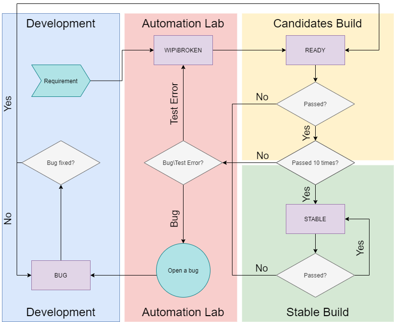

# Why stability is the most important thing in automation
1. Reliable Results: Stable automation ensures consistent and accurate results, giving confidence in the application's quality.

2. Efficient Testing: It reduces false results, letting testers focus on real issues and making testing more efficient.

3. Time and Cost Savings: Stable automation requires less maintenance and troubleshooting, saving time and effort.

4. Confidence in Releases: Trustworthy automation results help make informed decisions about software releases.

5. Scalability: Stable automation supports growth and changes across different environments.

6. Integration with CI/CD: It plays a vital role in continuous integration and delivery, providing fast and reliable feedback.
# Always Green, Clean & Seen
"Always Green" in automation testing means striving for a state where tests consistently pass without failures or inconsistencies. It involves the following principles:

1. No Failing Tests: The goal is to have no tests that fail. This indicates that the automated tests are working well and providing reliable results.

2. No Flaky Tests: Flaky tests are ones that sometimes pass and sometimes fail without any changes in the application. "Always Green" aims to eliminate such tests to maintain stability and reliability.

3. False Negatives: False negatives are when a test fails to detect a genuine issue in the application. They are the weak point of automation. "Always Green" focuses on reducing false negatives by ensuring good test coverage and accurate failure detection.

4. Always Clean: "Always Clean" emphasizes cleaning up resources, data, and artifacts after each test. This helps maintain a clean and consistent environment for subsequent tests.

5. Always Seen: Every failure is given full attention. When a test fails, it is thoroughly investigated to understand the cause and prevent similar failures in the future.

By following the principles of "Always Green," automation testing aims to achieve reliability, accuracy, cleanliness, and proper handling of failures. This contributes to improved software quality and efficient development processes.
# Test Lifecycle
1. Check the requirements of the feature being tested.
2. Plan the test and gather necessary data.
3. Develop the test.
4. Run the test.
5. If the test passes, perform additional runs to ensure stability.
6. Include the test in the desired test suite across various systems.
7. If the test fails:
    - Check if it's a problem with the test itself.
        - If so, return to development and improve its performance.
    - Check if it's a bug in the tested feature.
        - If so, log it as a bug and transfer it to the development team.
8. Once the bug is resolved, rerun the test until it becomes fully stable.

