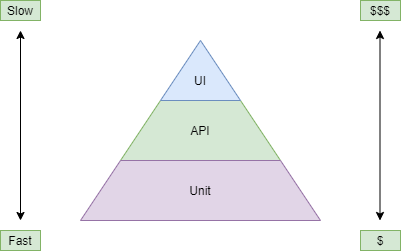

The Tests Pyramid is a concept that guides the distribution of different types of tests. It has three layers:

1. Unit Tests: These are small, quick tests that check individual code components. They catch bugs early and form the largest part of the pyramid.
2. Integration Tests: These tests check how different components work together. They ensure smooth communication and cover a wider scope than unit tests.
3. UI Tests: These tests simulate user interactions with the application's interface. They validate the overall user experience but are slower and more fragile.

4. Tests can be slow or fast: Unit tests are fast, focusing on small code parts. Integration tests take longer, checking how parts work together. 
UI tests are slower, mimicking user interactions. 
Fast tests give quick feedback.
5. Tests can be expensive or cheap: Unit tests are cheap, easy to write. 
Integration tests require more resources. UI tests can be expensive due to complexity. 
Balancing cost and coverage matters.

The Tests Pyramid suggests having a solid base of unit tests, followed by a moderate number of integration tests, and a smaller number of UI tests. 
This approach balances maintainability, efficiency, and speed. 
It optimizes testing efforts, reduces testing time, and provides reliable feedback on the application's quality.

