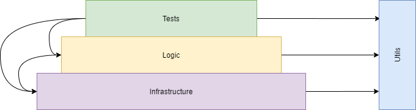

# Intro
Infrastructure layers in automation testing are a structured approach to organizing the components and technologies that support test execution. They provide several benefits:

- Modularity: Layers focus on specific responsibilities, allowing for easier maintenance and updates without affecting other layers.
- Separation of Concerns: Each layer has a specific purpose, promoting clear division of responsibilities and efficient collaboration.
- Abstraction and Reusability: Layers build upon lower layers, enabling code reuse and encapsulation of complex functionalities.
- Flexibility and Adaptability: Layers allow for technology choices and tooling flexibility, making it easy to adapt to changing requirements.
- Hierarchical Structure: Layers are organized hierarchically, providing a solid foundation and gradual refinement of capabilities.

With infrastructure layers, automation testers can achieve a modular, scalable, and maintainable testing environment, supporting efficient development and long-term success.
# Infrastructure (Infra) Layer
This layer sets up the necessary resources and configurations for running automated tests. It includes browsers, databases etc....

# Logic Layer
The logic layer contains the core business logic and functionalities of the application being tested. 
It handles the underlying logic that drives the application's behavior , Actions on pages, api calls, entities of the app and more....

# Test (+Steps) Layer
The test layer consists of the actual test cases and test steps. It defines the specific scenarios to be tested and the actions to be performed. 
In addition, in this layer we can also find configuration files and other files that help us with various integrations of the project.

# Utils (Utilities) Layer
The utils layer provides utility functions, helper classes, and reusable components. 
It offers common functionalities such as data generation, assertion methods, logging, and interaction with external systems.
# Layer as a product 
Each layer in automation testing can be seen as a product or service used by other layers:

- Infra Layer: Provides the necessary infrastructure and resources for test execution.
- Logic Layer: Offers the core business logic and functionalities of the application.
- Test (+Steps) Layer: Utilizes the logic layer to create test cases and define test steps.
- Utils Layer: Provides utility functions and reusable components for enhanced capabilities.

These layers work together, with each layer acting as a product or service that supports and interacts with the other layers.

