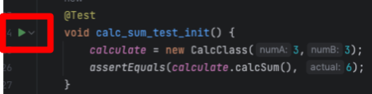

# Overview
JUnit is a testing framework for Java programs that helps developers write and run automated tests. Here's a simplified explanation of JUnit:

- JUnit is a testing framework for Java.
- It helps developers write and run automated tests.
- Tests written using JUnit check if specific parts of the code work as expected.
- JUnit provides annotations and assertions to define and verify test cases.
- Test cases are organized into test classes, which contain methods annotated with JUnit annotations.
- The framework provides features for setting up test data, running tests, and checking the results.
- JUnit tests can be executed individually or in groups.
- Test results are reported, indicating which tests passed, failed, or encountered errors.
- JUnit is widely used in Java development to ensure the quality and reliability of code.

In summary, JUnit is a popular testing framework for Java that simplifies the process of writing and executing automated tests to verify the correctness of Java code.
# Adding JUnit to a project
In our curse we work with Apache Maven software project management
For this we add the the JUnit to the maven dependency:
```html
<dependency>
    <groupId>org.junit.jupiter</groupId>
    <artifactId>junit-jupiter-engine</artifactId>
    <version>5.9.1</version>
    <scope>test</scope>
</dependency>
```
After we adding the JUnit library to our project we can create a test class and implements the tests in this class

For example:
```java
public class MyTest {
    private static CalcClass calculate;

    @Test
    void calc_sum_test() {
        calculate = new CalcClass();
        assertEquals(calculate.calcSum(3,3),6);
    }
}
```
# Run the test
You can run the test class using an IDE or a build tool like Maven or Gradle. 
If you're using an IDE, you can right-click on the test class and select "Run". 

If you're using Maven, you can run the following command in the terminal:

`mvn test`


Another way is with the help of the ide we use (intellij) it is possible to run through the green Play button near our test as in the following screenshot:


**View the Test Results**

After running the tests, you'll see the test results in the console or in the test runner tool of your IDE. JUnit will report whether each test has passed or failed.

