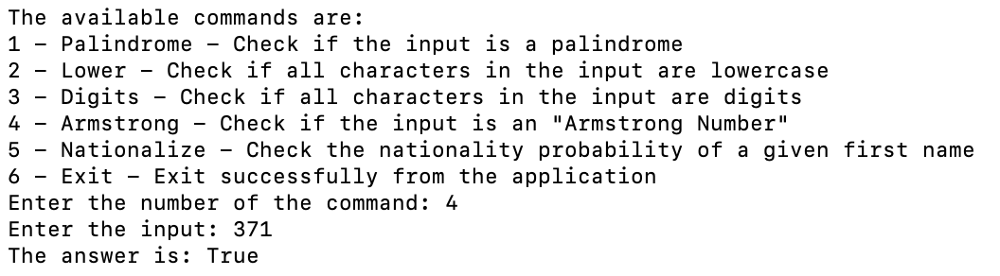

Are you ready to write your first CLI (**C**ommand **L**ine **I**nterface) application?!

## Flow
1. We show the user the available commands
1. We ask the user to choose a command number (they are numbered)
1. We ask the user to enter an input
1. We execute the command over the input
1. We show the user the result
1. We repeat the entire flow until the user selects the exit command

Here is a screenshot of the app flow from the terminal:

## Instructions

1. Palindrome - Check if the input is a palindrome
2. Lower - Check if all characters in the input are lowercase
3. Digits - Check if all characters in the input are digits
4. Armstrong - Check if the input is an "[Armstrong Number](https://en.wikipedia.org/wiki/Narcissistic_number)"
5. Nationalize - Check the nationality probability of a given first name. Use this https://nationalize.io/ to get the nationality probability of a given name and then use [this JSON file](.guides/data/countryISO2Name.json) to convert country ISO code (e.g. IL) to country name (e.g Israel). Print the first (most probable) result only with its probability percentage. For example, for "Yuval" the output should be "Israel 96.4%" 
6. Exit - Exit successfully from the application

Use OOP principles (e.g. encapsulation, polymorphism) for implementing the application in a way that adding more commands in the future will make minimal changes in existing code. 

Good Luck!
