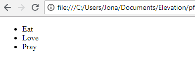

First, if you have anything inside your `body` element delete it so we can start fresh. The most common tags are:

-   div
-   h1, h2, ... h6
-   p
-   ul/ol, li (they go together)
-   span
-   img
-   a
-   input
-   button

***
#### DIVS

A `div` is one of the most basic tags out there. You'll be using them a lot. It is a **block** element.

Visually, a `div` doesn't do anything on its own, but it will help us organize elements on the page and style them (later, with CSS).

Try adding a div with some text in it. It should come up on the page pretty plain.

Now try **nesting** a couple of divs in one outer div (!!). It should still come out pretty plain, but it'll be useful later.

Did you get it?

<details><summary>
  Click here to reveal the answer.
</summary>

\<div>
\<div>text1\</div>
  \<div>text2\</div>
\</div>

</details>

</br>


**Nesting elements** is a common practice that helps us group elements that should go together into one element, so that we can apply styling more easily.

***
#### HEADERS

Headers give us built in ways to display large, prominent text on the screen. They are also block elements. The tags are:

- h1
- h2
- ...
- h6

Try it out, see what the differences are. Remember, the syntax is still \<h1>Some Text\</h1>

***

#### P

The `p` tag is also similar to the `div`, it is also a block element, but it is semantically different in that `p`s should **not** contain anything in them other than text.

Try a `p` out for yourself, see how it looks.

<details><summary>
  Click here to reveal the answer.
</summary>

It should look the same as a div. Don't worry, CSS will make the differences more meaningful ;)

</details>

***
#### LISTS

We use one `ul` to open a list (or `ol` if we want it to be numbered), and we use `li` to make the actual list items. The `li` elements are nested inside the `ul` one.

Try to figure this one out on your own! If you got it right, it should look something like this:




If you're stuck, here's a solution:

<details><summary>
  Click here to reveal the answer.
</summary>

\<ul>
\<li>Eat\</li>
\<li>Love\</li>
\<li>Pray\</li>
\</ul>

</details>

***
#### SPAN, IMG, & a

We've talked about these above, so play around with your own now!

***
#### INPUT

Inputs are ways for user to.. input data that we can later capture.

Inputs can have a few **attributes**, but we'll focus on these two for now:
- placeholder - some text to display before the user types ("Type here!" in the above input)
- type - what kind of input the user can type

For instance, the above `input` is of type "text", so you can type anything.

To see what these different kinds of inputs look when rendered on a page, check out [this codepen](https://codepen.io/ElevationPen/pen/vwPMzg?editors=0010).

* * * * *

#### BUTTON

For now it will be pretty useless, but we can create buttons that eventually will allow the user to interact with our page. To create a button you use the `button` tag (no surprise there), and it looks like this:
```html
<button>Sell my soul</button>
```

Try it out to see what it looks like when rendered